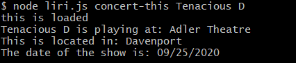
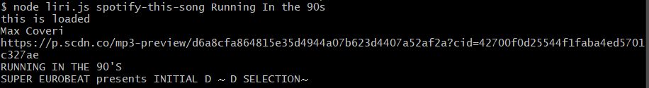
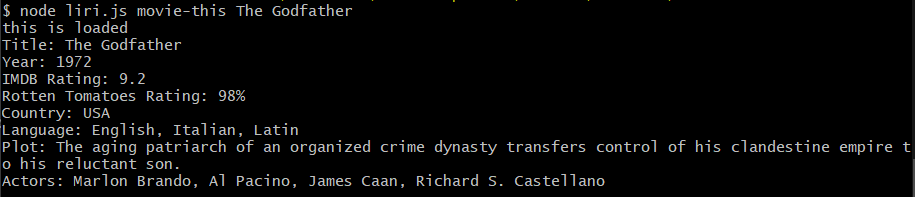
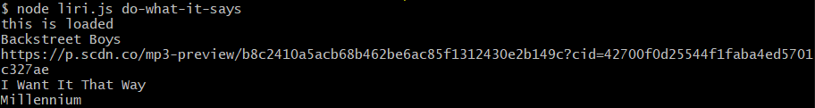

# LIRI-Bot

LIRI, short for Language Interpretation and Recognition Interface, is a simple app that uses the command line to take in parameters in exchange for relevant data. Its uses include searching Spotify, Bands in Town, and OMDB for information on songs, concerts, and movies, respectively.

### Prerequisites

Multiple node packages are required to use this app. They are listed below.


* node-spotify-api
* OMDB
* bandsintown
* moment
* axios
* dotenv
* fs


### INSTALLATION

`npm install`

### PLEASE NOTE

You will need to register with Spotify Developers for an API key in order to use the Spotify API. In addition, the key must be provided within a .env file contained in the main folder with the following format:

```
# Spotify API keys

SPOTIFY_ID=your-spotify-id
SPOTIFY_SECRET=your-spotify-secret

```


### USAGE

CD into the main folder using your terminal. Type "node liri.js" into the command line to initialize the app, as well as an appropriate number of arguments for one of the following commands.

1. concert-this
2. spotify-this-song
3. movie-this
4. do-what-it-says

## EXAMPLE ENTRY

* node liri.js concert-this `<band/artist>`



* node liri.js spotify-this-song `<song name>`



* node liri.js movie-this `<movie name>`



* node liri.js do-what-it-says 




The "do-what-it-says" function will read commands from a text file in the repo called random.txt.  It is configurable to take any of the above commands, but by default has the "spotify-this-song" command targeting "I Want It That Way" by the Backstreet Boys.
